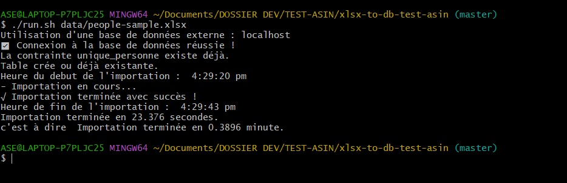
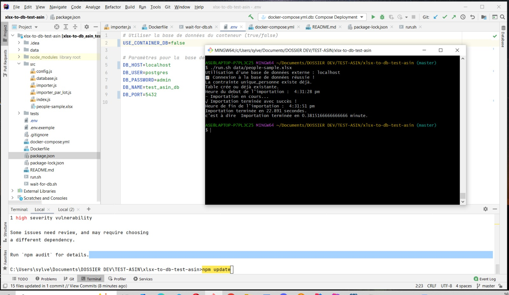

# README.md - Importation de fichiers XLSX vers PostgreSQL

## 📌 Description
Cette application permet d'importer un fichier `.xlsx` contenant des informations sur des personnes dans une base de données PostgreSQL. L'importation est optimisée pour être réalisée en moins de 2 minutes, même pour des fichiers volumineux.

## 🚀 Installation et Configuration

### 1. Prérequis
- **Node.js** (version 18 ou supérieure)
- **Docker & Docker Compose**
- **PostgreSQL** (si utilisé en dehors du conteneur)

### 2. Installation

Clonez le dépôt et installez les dépendances :

```bash
git clone https://github.com/bassarou120/xlsx-to-db-test-asin.git
cd xlsx-to-db-test-asin
npm install
```

Copiez le fichier `.env.example` en `.env` et configurez vos paramètres PostgreSQL :

```bash
cp .env.example .env
nano .env
```

## 📂 Utilisation

### 1. Lancer l'application avec Docker

Si vous utilisez PostgreSQL via Docker, exécutez :

```bash
./run.sh chemin/vers/fichier.xlsx
```

L'application démarre la base de données et importe les données du fichier fourni.

### 2. Exécuter sans Docker (Base de données externe)

Assurez-vous que PostgreSQL est en cours d'exécution et exécutez :

```bash
node src/index.js chemin/vers/fichier.xlsx
```
## 📊 Voir le contenu de la base de données (Docker)

Si vous utilisez PostgreSQL dans un conteneur Docker, vous pouvez accéder aux données avec les commandes suivantes :

1. Ouvrir un terminal interactif PostgreSQL dans le conteneur :

```bash
docker exec -it postgres_db psql -U postgres -d test_asin_db
```

Attention :  executer cette commande en fonction de vos paramettres de le fichier .env

2. Lister les tables disponibles :

```sql
\dt
```

3. Voir le contenu de la table `personnes` :

```sql
SELECT * FROM personnes LIMIT 20;
```

4. Quitter PostgreSQL :

```sql
\q
```

## 📊 Performance
L'application affiche le temps total d'importation à la fin du processus.

## 📌 Fonctionnalités
✅ Importation rapide en lots (batchs de 10 000 lignes)
✅ Gestion des doublons (contrainte UNIQUE sur matricule, nom, prénom, date de naissance)
✅ Prise en charge de plusieurs formats de date
✅ Exécution avec ou sans Docker
✅ Fichiers volumineux pris en charge

## 🛠️ Tests

Exécutez les tests unitaires avec :

```bash
npm test
```

## 📷 Capture d'écran

des capture d'ecran  sur un pc Lenovo  de 12Gb de RAM







Capture d'ecran  sur un pc mac book de 4GB de RAM


---

🚀 **Développé avec Node.js, PostgreSQL et Docker**.
